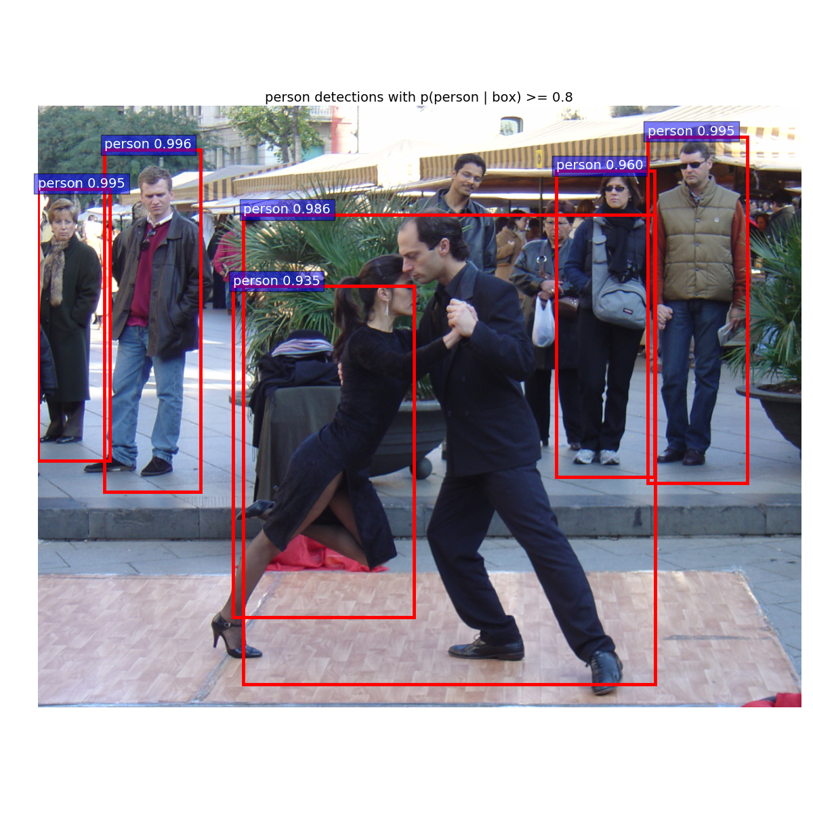

#Entrenar faster-RCNN con tu propio conjunto de datos

Este asombroso proyecto ayuda a entender más acerca del aprendizaje profundo y su poder. Sin embargo, sólo hay un modelo de faster-rcnn pre-entrenado para pascal voc con 20 clases. Para utilizar este proyecto en aplicaciones reales, necesitas entrenar un modelo en el conjunto de datos de tu eleccion.

Vamos a ilustrar cómo entrenar Faster-RCNN con tu propio conjunto de datos, y tomaremos [INRIA Person](http://pascal.inrialpes.fr/data/human/) como ejemplo del conjunto de datos.

###Clona el repositorio py-faster-rcnn

Este tutorial necesita que hayas clonado y probado el repositorio py-faster-rcnn de rbgirshick.

	$ git clone https://github.com/rbgirshick/py-faster-rcnn

Antes de comenzar a entrenar py-faster-rcnn con tu propio conjunto de datos, ten en cuenta lo siguiente, asegúrate haber seguido los pasos originales para reproducir correctamente el resultado del demo.

###Obten el conjunto de datos

Al descargar y extraer el conjunto de datos de Inria Person se obtendrá esta arquitectura:

	|-- INRIAPerson/
	    |-- 70X134H96/
	    |-- 96X160H96/
	    |-- Test/
	    |-- test_64x128_H96/
	    |-- Train/
	    |-- train_64x128_H96/


###Dar Formato al conjunto de datos

El conjunto de datos debe estar bien organizado con el formato requerido,usaremos esta arquitectura para cada conjunto de datos en $py-faster-rcnn/data

Una forma sencilla de lograrlo es usar enlaces simbólicos:

	$ cd $py-faster-rcnn/data
	$ mkdir INRIA_Person_devkit/
	$ mkdir INRIA_Person_devkit/data/
	$ ln -s <INRIAPerson>/Train/annotations/ INRIA_Person_devkit/data/Annotations
	$ ln -s <INRIAPerson>/Train/pos/ INRIA_Person_devkit/data/Images

	INRIA
	| - data
	     | - Annotations
	          | - * .txt (Archivos de anotación)
	     | - Images
	          | - * .png (Archivos de imagen)
	     | - ImageSets
	          | - train.txt


  - Annotations: Esta carpeta contiene todos los archivos de anotación de las imágenes. En la implementación de INRIA, está en formato `.txt`. Pero tambien se puede tener una implementación en formato XML Para cada archivo de anotación (cada imagen), sólo hay una clase y también un objeto que necesito describir. A continuación se muestra un ejemplo

```
<? person_819.xml ?>
<annotation>
  <folder>kaggle</folder>
    <filename>
      <item>person_819.jpg</item>
    </filename>
    <object>
      <name>person</name>
      <bndbox>
        <xmin>1277</xmin>
        <ymin>568</ymin>
        <xmax>1554</xmax>
        <ymax>961</ymax>
      </bndbox>
    </object>
</annotation>
```

Si utilizas [MATLAB](https://www.mathworks.com/help/vision/ug/label-images-for-classification-model-training.html) para etiquetar las imagen de entrenamiento, o tu conjunto de datos está en formato `.mat`, para la conversión desde el archivo` .mat` al archivo `.xml`, consulta [convert_mat_to_xml.m] (https: / /github.com/coldmanck/fast-rcnn/blob/master/convert_mat_to_xml/convert_mat_to_xml.m).

Si necesitas una herramienta libre para generar tu propio archivo de Anotaciones puedes encontrarlo [aqui](https://github.com/tzutalin/labelImg)

  - Images: Esta carpeta contiene todas las imágenes de entrenamiento

  - ImageSets: Esta carpeta originalmente sólo contiene un archivo - train.txt, que contiene todos los nombres de las imágenes de entrenamiento (sin extensión, por ejemplo .jpg). Se parece a esto:

```sh
	crop_000011
	crop_000603
	crop_000606
	crop_000607
	crop_000608
```

Necesitamos escribir train.txt que contenga todos los nombres (sin extensiones) de archivos de imágenes que serán utilizados para el entrenamiento. Básicamente con el siguiente comando:

	$ cd $py-faster-rcnn/data/INRIA_Person_devkit/data/
	$ mkdir ImageSets
	$ ls Annotations/ -m | sed s/\\s/\\n/g | sed s/.txt//g | sed s/,//g > ImageSets/train.txt

###Construir el archivo IMDB

####Añadir lib/datasets/inria.py

Necesitamos crear un archivo inria.py en el directorio `$py-faster-rcnn/lib/datasets`. Este archivo define algunas funciones que le dicen a faster-rcnn cómo leer las cajas de verdad y cómo encontrar imágenes en disco.A continuación, deben seguirse los siguientes pasos.

  - Modifique self._classes en la función constructor para que se ajuste a tu conjunto de datos.
  - Tenga cuidado con las extensiones de sus archivos de imagen. Consulte `image_path_from_index` en `inria.py`.
  - Escriba la función para analizar las anotaciones. Consulte `_load_inria_annotation` en `inria.py`.
  - No olvide agregar sintaxis `import` en tu propio archivo python y otros archivos python en el mismo directorio.
```sh
	self._classes = ( '__background __', 'person')
	self._image_ext = ['.png','jpg']
```
Estas dos líneas especifican clases y extensiones de imagen. Por el bien del tiempo, sólo elegí 2 clases de n clases del conjunto de datos.

####_load_inria_annotation

Esta es una función importante para nuestro entrenamiento, le dice a faster rcnn cómo leer los archivos de anotación.Se debe prestar especial atención a estas cuatro líneas:

```sh
x1 = float(get_data_from_tag(obj, 'xmin')) - 1
y1 = float(get_data_from_tag(obj, 'ymin')) - 1
x2 = float(get_data_from_tag(obj, 'xmax')) - 1
y2 = float(get_data_from_tag(obj, 'ymax')) – 1
```

Esto se debe a que en el grupo de datos de pascal voc, todas las coordenadas comienzan desde uno, por lo que para que empiecen a partir de 0, necesitamos restar 1. Pero esto no es cierto para nuestro conjunto de datos, por lo que no deberíamos restar 1. Lo mismo vale para `Box_list.append (raw_data [i] [:, (1, 0, 3, 2)] - 1)`. Así que necesitamos modificar estas líneas:

```sh
X1 = float (get_data_from_tag (obj, 'xmin'))
Y1 = float (get_data_from_tag (obj, 'ymin'))
X2 = float (get_data_from_tag (obj, 'xmax'))
Y2 = float (get_data_from_tag (obj, 'ymax'))
Box_list.append (raw_data [i] [:, (1, 0, 3, 2)])	
```
A continuación, debe modificar `factory.py` en el mismo directorio. Por ejemplo, para añadir **INRIA Person**, debemos añadir

```sh
inria_devkit_path = '/home/ubuntu/py-faster-rcnn/data/INRIA_Person_devkit'
for split in ['train', 'test']:
    name = '{}_{}'.format('inria', split)
    __sets[name] = (lambda split=split: inria(split, inria_devkit_path))
```
###Adaptar el modelo de red

Si se desea utilizar el modelo VGG16 con optimizaciones alternativas, se debe hacer una copia y adaptar el modelo en `/py-faster-rcnn/models/pascal_voc/VGG16/faster_rcnn_alt_opt`

```sh
$ cd py-faster-rcnn/models/
$ mkdir INRIA_Person/
$ cp -r pascal_voc/VGG16/faster_rcnn_alt_opt/ INRIA_Person/
```
###Modificar las capas del prototxt y renombrar

Cambie el nombre de las capas `cls_score` y `bbox_pred` en `VGG16/faster_rcnn_alt_opt`. Por ejemplo, lo cambio de nombre a `cls_score_in` y `bbox_pred_in`.
```sh
$ grep bbox_pred VGG16/faster_rcnn_alt_opt/*.pt
	VGG16/faster_rcnn_alt_opt/faster_rcnn_test.pt:  name: "bbox_pred"
	VGG16/faster_rcnn_alt_opt/faster_rcnn_test.pt:  top: "bbox_pred"
	VGG16/faster_rcnn_alt_opt/stage1_fast_rcnn_train.pt:  name: "bbox_pred"
	VGG16/faster_rcnn_alt_opt/stage1_fast_rcnn_train.pt:  top: "bbox_pred"
	VGG16/faster_rcnn_alt_opt/stage1_fast_rcnn_train.pt:  bottom: "bbox_pred"
	VGG16/faster_rcnn_alt_opt/stage2_fast_rcnn_train.pt:  name: "bbox_pred"
	VGG16/faster_rcnn_alt_opt/stage2_fast_rcnn_train.pt:  top: "bbox_pred"
	VGG16/faster_rcnn_alt_opt/stage2_fast_rcnn_train.pt:  bottom: "bbox_pred"

grep cls_score VGG16/faster_rcnn_alt_opt/*.pt
	VGG16/faster_rcnn_alt_opt/faster_rcnn_test.pt:  name: "cls_score"
	VGG16/faster_rcnn_alt_opt/faster_rcnn_test.pt:  top: "cls_score"
	VGG16/faster_rcnn_alt_opt/faster_rcnn_test.pt:  bottom: "cls_score"
	VGG16/faster_rcnn_alt_opt/stage1_fast_rcnn_train.pt:  name: "cls_score"
	VGG16/faster_rcnn_alt_opt/stage1_fast_rcnn_train.pt:  top: "cls_score"
	VGG16/faster_rcnn_alt_opt/stage1_fast_rcnn_train.pt:  bottom: "cls_score"
	VGG16/faster_rcnn_alt_opt/stage2_fast_rcnn_train.pt:  name: "cls_score"
	VGG16/faster_rcnn_alt_opt/stage2_fast_rcnn_train.pt:  top: "cls_score"
	VGG16/faster_rcnn_alt_opt/stage2_fast_rcnn_train.pt:  bottom: "cls_score"
```

Como tengo dos clases (background y person), necesito cambiar la estructura de la red para que se ajusten al conjunto de datos.
Se refiere a la cantidad de clases que desea entrenar. Supongamos que el número de clases es C (no olvide contar la clase de fondo). Entonces:

```sh
Modifique num_classes a C;
Modifique num_output en la capa cls_score a C
Modifique num_output en la capa bbox_pred a 4 * C
```

Basicamente para este clasificador binario (Person vs Background) C=2 y tenemos:

```sh
    - 7 lineas modificadas de 21 a 2
    - 3 lineas modificadas de 84 a 8
```

```sh
$ grep 21 VGG16/faster_rcnn_alt_opt/*.pt
	VGG16/faster_rcnn_alt_opt/faster_rcnn_test.pt:    num_output: 21
	VGG16/faster_rcnn_alt_opt/stage1_fast_rcnn_train.pt:    param_str: "'num_classes': 21"
	VGG16/faster_rcnn_alt_opt/stage1_fast_rcnn_train.pt:    num_output: 21
	VGG16/faster_rcnn_alt_opt/stage1_rpn_train.pt:    param_str: "'num_classes': 21"
	VGG16/faster_rcnn_alt_opt/stage2_fast_rcnn_train.pt:    param_str: "'num_classes': 21"
	VGG16/faster_rcnn_alt_opt/stage2_fast_rcnn_train.pt:    num_output: 21
	VGG16/faster_rcnn_alt_opt/stage2_rpn_train.pt:    param_str: "'num_classes': 21"

$ grep 84 VGG16/faster_rcnn_alt_opt/*.pt
	VGG16/faster_rcnn_alt_opt/faster_rcnn_test.pt:    num_output: 84
	VGG16/faster_rcnn_alt_opt/stage1_fast_rcnn_train.pt:    num_output: 84
	VGG16/faster_rcnn_alt_opt/stage2_fast_rcnn_train.pt:    num_output: 84
```
### Renombrar capas en otros archivos

Del mismo modo, en los archivo específicados abajo, busque `cls_score` y` bbox_pred` y cambie el nombre a `cls_score_in` y `bbox_pred_in`
- `$ py-faster-rcnn/lib/fast_rcnn/train.py`
- `$ py-faster-rcnn/lib/fast_rcnn/test.py`

## Iniciar el entrenamiento

En el directorio `$py-faster-rcnn`, ejecute el siguiente comando en el shell.

```sh
$ ./tools/train_faster_rcnn_alt_opt.py --gpu 0 --net_name INRIA_Person --weights data/imagenet_models/VGG16.v2.caffemodel --imdb inria_train
```
Dónde:

```sh
--net_name es el nombre de la carpeta en $py-faster-rcnn/models
	(el script train_faster_rcnn_alt_opt.py buscará automáticamente en la subcarpeta /faster_rcnn_alt_opt/ los archivos .pt)
--weights es la ubicación de los pesos pre-entrenados en .caffemodel
--imdb es el nombre completo de la base de datos como se especifica en el archivo lib/datasets/factory.py
	(no te olvides de añadir el sufijo test/train !)
```

Opcionalmente puedes modificar el script en `/py-faster-rcnn/experiments/scripts` y ajustarlo a tu propio conjunto de datos. Una vez modificado ejecuta el comando

```sh
./experiments/scripts/faster_rcnn_alt_opt.sh 0 VGG16 inria
```

###Ver Resultado de Entrenamiento
 
Simplemente hay que copiar el modelo entrenado en `$/py-faster-rcnn/output/faster_rcnn_alt_opt/train/VGG16_faster_rcnn_final.caffemodel` a `/data/faster_rcnn_models/`. Luego ejecute ./tools/demo.py en `$py-faster-rcnn` para ver cómo funciona nuestro modelo entrenado. Por supuesto, los cambios deben hacerse en el archivo `demo.py` para usar el modelo entrenado.Puedes encontrar el mío aquí como referencia.


## Demo
<tr>
<td>


</td>
</tr>


